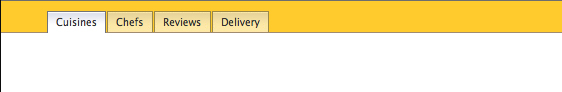

# FlexNav

- [FlexNav](#flexnav)
  - [Homework](#homework)
    - [Part One](#part-one)
  - [Reading](#reading)
  - [The Terminal](#the-terminal)
    - [A Note For Windows Users](#a-note-for-windows-users)
  - [Initialize GIT and Create a Branch](#initialize-git-and-create-a-branch)
  - [The Project](#the-project)
  - [Node Package Manager (NPM)](#node-package-manager-npm)
    - [NPM Demos](#npm-demos)
    - [NPM init](#npm-init)
  - [Flexbox](#flexbox)
    - [Aside: Flex Order](#aside-flex-order)
  - [JavaScript](#javascript)
    - [Preview \& Review - Boulevards de Paris](#preview--review---boulevards-de-paris)
      - [Arrays](#arrays)
  - [JavaScript Navigation](#javascript-navigation)
    - [Aside: Prettier](#aside-prettier)
    - [Content](#content)
    - [Aside - Design Patterns](#aside---design-patterns)
    - [Event Delegation](#event-delegation)
    - [Working with Objects](#working-with-objects)
    - [An Array of Objects](#an-array-of-objects)
- [Homework and Review](#homework-and-review)
  - [Selectors](#selectors)
    - [document.querySelectorAll();](#documentqueryselectorall)
    - [document.querySelector();](#documentqueryselector)
  - [Element.matches()](#elementmatches)
  - [Type-specific selector methods](#type-specific-selector-methods)
  - [Loops](#loops)
    - [for](#for)
    - [for…of](#forof)
    - [for…in](#forin)
  - [Loop over plain objects ({}).](#loop-over-plain-objects-)
    - [Skipping and ending loops](#skipping-and-ending-loops)
  - [Array.forEach() and NodeList.forEach()](#arrayforeach-and-nodelistforeach)
  - [Classes](#classes)
    - [Element.classList](#elementclasslist)
    - [Element.className](#elementclassname)
  - [Styles](#styles)
    - [Inline Styles](#inline-styles)
    - [Computed Styles](#computed-styles)
  - [Attributes \& Properties](#attributes--properties)
  - [Properties](#properties)
  - [Attributes vs. Properties](#attributes-vs-properties)
  - [Event Listeners](#event-listeners)
    - [EventTarget.addEventListener()](#eventtargetaddeventlistener)
    - [Multiple Targets](#multiple-targets)
    - [Capturing events that don’t bubble](#capturing-events-that-dont-bubble)
    - [Multiple Events](#multiple-events)
  - [Assignment](#assignment)
    - [Getting Setup](#getting-setup)
    - [Listening for clicks](#listening-for-clicks)
    - [Determining whether to show or hide passwords](#determining-whether-to-show-or-hide-passwords)
    - [Showing and hiding passwords](#showing-and-hiding-passwords)
    - [Styling the button](#styling-the-button)

## Homework

### Part One

Continue with the Front End Masters - the entire [CSS section](https://frontendmasters.com/courses/web-development-v3/css-overview-rules/).

<!-- Examine the files in the `other/homework` folder in your browser. `index.html` is your starting point and `index-done.html` your goal. Your assignment is to edit `index.html` so it matches the goal _without peeking at or inspecting the code in the done version_.

The designs need not match _exactly_, don't get too hung up on making the heights and widths of tabs etc. exactly the same.

That being said:

- the buttons / tabs should have a active state that shows after being clicked on
- use css flexbox and [this documentation]([start here](https://css-tricks.com/snippets/css/a-guide-to-flexbox/))
- responsive design is a must
- one tricky aspect of the responsive design is making the buttons drop below the logo and sign out link on small screens, research and use the `order` flex property to accomplish this
- take some time to research Font Awesome, how it works and how it is being used
- you shouldn't have to change the HTML but feel free to
- brownie points for changing the visual design to make it your own -->

<!-- ## Midterm

Copy the `other/homework` folder from the previous section (Flexnav) into a stand alone project.

- `index.html` is your starting point
- `index-done.html` the goal
- edit `index.html` so it matches the goal
- try not to copy directly, use `index-done.html` only when you get stuck

One task you will have to perform is not in the `index-done.html` file.

Using the notes in Basilica:

- add an empty div to the page
- use JavaScript to change the content of the div when the user clicks on the tabs

Make sure to create a local Git repo.

When you are done push your local repo to Github and use Netlify to deploy your assignment.

Send me a link to the Github repo as well as the Netlify site -->

## Reading

- [What is Flexbox](https://developer.mozilla.org/en-US/docs/Web/CSS/CSS_Flexible_Box_Layout/Using_CSS_flexible_boxes)
- See how far you can get on [Flexbox Froggy](http://flexboxfroggy.com/)
- Review the JavaScript documentation on MDN

---

## The Terminal

There are many good reasons to acquire a basic understanding of the command line terminal. In this class we will use the [Terminal](https://support.apple.com/guide/terminal/welcome/mac) app for GIT and GITHUB as well as for Node Package Manager (NPM).

<hr />

### A Note For Windows Users

A rough equivalent to the Unix Terminal is [Powershell](https://docs.microsoft.com/en-us/powershell/) but there are important differences. Alternatives to Powershell include the app that comes with [Git for Windows](https://gitforwindows.org/) aka "Git Bash." _Unless you are very experienced with Windows, I suggest using Git Bash instead of Powershell on Windows._

---

Some basic shell commands (note: the convention in documentation is to use `$` to indicate a prompt - do NOT include it when copying and pasting a command):

```sh
$ pwd  // print working directory
$ cd <path-to-folder> // change directory
$ cd .. // go up one level
$ cd ~ // go to your home directory
$ ls  // list files
$ ls -l  // flags expand the command
$ ls -al
```

Demo: tab completion and history.

Demo: on a mac you can `cd` into a folder via drag and drop or by copying and pasting a folder into the terminal.

Before continuing we will run the following commands:

```sh
$ node --version
$ npm --version
$ git --version
$ node
> var total = 12+12
> total
> var el = document.querySelector('.anything') // error
> .exit // or control + c to exit node
$ clear // or command + k to clear the terminal
```

Use `cd` or the copy and paste method to cd into today's folder.

If you want to learn more about the terminal try reading [this article](https://www.git-tower.com/blog/more-productive-mastering-terminal/?vgo_ee=e7b8PdtP0aWH7ZIgym%2BTUayPUFd7JHyq9acdSgULWaM%3D).

## Initialize GIT and Create a Branch

[Configure](https://git-scm.com/book/en/v2/Getting-Started-First-Time-Git-Setup) your installation of git:

```sh
$ git config --global user.name "John Doe"
$ git config --global user.email johndoe@example.com
$ git config --global init.defaultBranch main
$ git config --list
# $ :q
```

[Create a personal Access Token](https://docs.github.com/en/authentication/keeping-your-account-and-data-secure/creating-a-personal-access-token)

Initialize your repository:

```sh
$ git init
$ git add .
$ git commit -m 'initial commit'
$ git branch inclass
$ git checkout inclass
```

Note the `.gitignore` file.

Exercise: make a small change to the `.gitignore` file and the `readme` and merge them into the main branch.

## The Project



The UI is spare but the techniques and concepts employed are complex.

You will be introduced to:

- node package manager
- css flexbox
- css attribute selectors
- js template strings
- js data structures: arrays and objects
- js flow control: looping with forEach and for...of
- js DOM manipulation: innerHTML and classList
- new js event listeners
- working with routing, urls and hashes
- web site design patterns

---

Examine the `static` website in `other/design-patterns`. This is a static website that uses multiple HTML files.

Today we will be building a single page application - there is only one HTML page and JavaScript creates "the illusion" of multiple pages.

Create an `index.html` page in the `app` folder and scaffold it with Emmet's `html:5` macro.

Add a link to `styles.css` in `index.html`:

```html
<link rel="stylesheet" href="css/styles.css" />
```

Add the following to index.html:

```html
<nav>
  <ul>
    <li><a href="index.html">cuisines</a></li>
    <li><a href="chefs.html">chefs</a></li>
    <li><a href="reviews.html">reviews</a></li>
    <li><a href="delivery.html">delivery</a></li>
  </ul>
</nav>
```

We will open the file in a brower using the HTTP (as opposed to File://) protocol.

## Node Package Manager (NPM)

[Node Package Manager](https://www.npmjs.com) is an essential part of the web design and development ecosystem. [Node](https://nodejs.org/en/) includes NPM as part of its install.

In order to familiarize you with node packages and to test your Node installation we will install a server with hot reloading - as opposed to using VS Code's GoLive extension.

Note the presence of `package.json` in today's folder. Examine it in VS Code.

[JSON](https://en.wikipedia.org/wiki/JSON) (JavaScript Object Notation) is a file format often used for transmitting data. It is ubiquitious in web development.

```js
{
  "name": "flex-nav",
  "version": "1.0.0",
  "description": "A simple navbar",
  "main": "index.js",
  "scripts": {
    "start": "browser-sync app -w --port 1234"
  },
  "keywords": [],
  "author": "",
  "license": "ISC",
  "dependencies": {
    "browser-sync": "^2.27.7"
  }
}
```

---

### NPM Demos

- demo installing dependencies. Note the `node_modules` folder and the "lock" file.

Node modules are generally stored and developed on Github as repositories and registered as packages on a registry. The most common registry is [NPMJS](https://www.npmjs.com/).

- demo running the script

---

### NPM init

We will delete and recreate the `package.json`.

1. Delete `package.json`
2. `cd` to navigate to today's directory
3. Then initialize npm and install browser-sync:

```sh
$ npm init
$ npm install browser-sync
```

Note:

- the installed the software is listed in package.json dependencies ([Browser Sync](https://www.browsersync.io/))
- the addition of the installation folder: `node_modules`
- the new [package-lock.json](https://docs.npmjs.com/files/package-lock.json)
- the `.gitignore` file (added by me) declares that the contents of the node_modules folder should not be tracked by git

Examine the contents of `node_modules`.

<!-- Browser Sync is an [NPM Package](https://www.npmjs.com/package/browser-sync) that is developed by a team using [Github](https://github.com/BrowserSync/browser-sync). -->

<!-- ```sh
$ npm install browser-sync
``` -->

Add to the scripts section of package.json. This will allow us to start the server with `$ npm run start`.

```json
"scripts": {
  "start": "browser-sync app -w"
},
```

This script is a command line. It was written by consulting the command line [documentation](https://browsersync.io/docs/command-line).

Make a small change to the HTML and note the hot reloading.

Use `ctrl-c` to shut down the server.

Try editing the start script to specify the port number:

```json
"scripts": {
  "start": "browser-sync app -w --port 1234"
},
```

Restart the server with `$ npm run start`.

## Flexbox

[What is Flexbox](https://developer.mozilla.org/en-US/docs/Web/CSS/CSS_Flexible_Box_Layout/Using_CSS_flexible_boxes)?

- A good [reference](https://css-tricks.com/snippets/css/a-guide-to-flexbox/) cheat sheet
- `flex` is a _display_ attribute like `block, none, inline`
- Do not confuse it with _positioning_ which we have looked at for absolute, relative, static and fixed positioning
- Get familiar with [Can I Use](https://caniuse.com/#feat=flexbox) and [feature detection](https://developer.mozilla.org/en-US/docs/Learn/Tools_and_testing/Cross_browser_testing/Feature_detection)

Add and review some basic formatting in `app/styles.css`:

```css
body {
  margin: 0;
  font-family: -apple-system, BlinkMacSystemFont, "Segoe UI", "Roboto",
    "Oxygen", "Ubuntu", "Helvetica Neue", Arial, sans-serif,
    "Apple Color Emoji", "Segoe UI Emoji", "Segoe UI Symbol";
}
a {
  text-decoration: none;
  color: #333;
}
ul {
  margin: 0;
  padding: 0;
}
nav ul {
  list-style: none;
  background-color: #ffcb2d;
}
```

Note the complex looking `font-family` value. It is quite common to use a _system font stack_ that allows each operating system to use its native font. [Google](https://bit.ly/2kYnnOV) it.

You could try `font-family: system-ui;` but that only works in certain browsers. Consult [caniuse](https://caniuse.com/#feat=font-family-system-ui).

```css
nav ul {
  ...
  padding-top: 1rem;
  display: flex;
  justify-content: space-around;
  /* border on the bottom */
  background-image: linear-gradient(
    to bottom,
    #ffcb2d 0%,
    #ffcb2d 95%,
    #9b8748 100%
  );
  /* background: url(../img/bg.png) repeat-x bottom; */
  /* border-bottom: 1px solid #000; */
}

nav a {
  padding: 4px 8px;
  border: 1px solid #9b8748;
  border-radius: 3px 3px 0 0;
  background-color: #f9eaa9;
  opacity: 0.8;

  /* tab gradient */
  background-image: linear-gradient(
    to bottom,
    rgba(255, 236, 165, 1) 0%,
    rgba(232, 213, 149, 1) 6%,
    rgba(253, 233, 162, 1) 94%,
    rgba(253, 233, 162, 1) 100%
  );
}
```

Note: without `wrap` there is a horizontal scrollbar on very small screens: `flex-wrap: wrap;`

Add an `active` class to the first anchor tag in the navbar:

```html
<li><a class="active" href="index.html">cuisines</a></li>
```

Format the active link and the hover state:

```css
nav a:hover,
nav .active {
  background-image: linear-gradient(
    to bottom,
    rgba(255, 255, 255, 1) 0%,
    rgba(224, 226, 240, 1) 6%,
    rgba(254, 254, 254, 1) 53%
  );
  border-bottom: none;
  opacity: 1;
}
```

```css
/* prevents collapsing */
nav li {
  display: flex;
}
```

---

We have a meta tag:

```html
<meta name="viewport" content="width=device-width" />
```

```css
@media (min-width: 460px) {
  nav ul {
    padding-left: 1rem;
    justify-content: flex-start;
  }
  nav li {
    margin-right: 1rem;
  }
}
```

See [this Pen](https://codepen.io/DannyBoyNYC/pen/dawPQz) for some basic info on how to control flexbox responsively.

### Aside: Flex Order

Flex order property (demo only):

```css
nav :nth-child(2) {
  order: 1;
}
```

## JavaScript

### Preview & Review - Boulevards de Paris

<!-- See `other/ARRAYS.js` (use Quokka extension for VS Code). -->

Recall: `document.querySelector('<css selector>')` returns the first selected item.

Navigate to this [Wikipedia](https://en.wikipedia.org/wiki/Category:Boulevards_in_Paris) article.

Our goal is to capture all the boulevards in Paris the contain "de" and store them in an array. I will introduce you to some of the JavaScript we will be using later on our page.

Paste the following in the browser's console and test:

```js
var first = document.querySelector("a");
```

`document.querySelectorAll()` returns a collection (`nodeList`) of the items on the page:

```js
var all = document.querySelectorAll("a");
```

Demo: console history.

Right click to inspect the first listed boulevard (Boulevard Auguste-Blanqui) and find `<div class="mw-category">` in the DOM. (Note: You can reference the currently selected element using `$0` in the console.)

```js
var category = document.querySelector(".mw-category");
```

We can use our `category` variable as the basis for a subsequent, more targeted query:

```js
var links = category.querySelectorAll("a");
```

Examine the methods on the resulting nodeList. Try `links.length` in the console.

Our nodeList looks like an array but isn't. Let's convert the nodeList into an Array:

```js
var linksArray = Array.from(links);
```

- Examine the methods on the resulting Array and compare them to the methods on a nodeList
- Examine one of the anchor tags from the resulting array in the console:

```js
linksArray[0];
linksArray[0].text;
```

#### Arrays

We commonly use loops to iterate through an array and perform some action.

Below we initialize an empty array `linkText` and then loop through the linksArray using its length property. For every item in linksArray we use Array.push() to add it to linkText:

```js
var linkText = [];

for (let i = 0; i < linksArray.length; i++) {
  linkText.push(linksArray[i].textContent);
}
```

See [for](https://developer.mozilla.org/en-US/docs/Web/JavaScript/Reference/Statements/for) on MDN.

Note: another way to create our array of text items is:

```js
var linkText = [];

for (let link of linksArray) {
  linkText.push(link.text);
}
```

See [for...of](https://developer.mozilla.org/en-US/docs/Web/JavaScript/Reference/Statements/for...of) on MDN.

Let's look at a couple of important [array methods](https://developer.mozilla.org/en-US/docs/Web/JavaScript/Reference/Global_Objects/Array): [`array.map()`](https://developer.mozilla.org/en-US/docs/Web/JavaScript/Reference/Global_Objects/Array/map) and [`array.filter()`](https://developer.mozilla.org/en-US/docs/Web/JavaScript/Reference/Global_Objects/Array/filter)

Here's an example that uses the array's [`map`](https://developer.mozilla.org/en-US/docs/Web/JavaScript/Reference/Global_Objects/Array/map) method to isolate the text content from our linksArray:

```js
var linkTextTwo = linksArray.map(function (link) {
  return link.textContent;
});
```

```js
var linkTextTwo = linksArray
  .map(function (link) {
    return `${link.textContent} is in paree`;
  })
  .join(" AND ");
```

<!-- Here's an alternative form of the same thing using an arrow function:

```js
var linkText = linksArray.map((link) => link.textContent);
```

Note that we use `=>` instead of the word `function`. Since we only have one variable, we could also remove the round braces:

```js
var linkText = linksArray.map((link) => link.textContent);
``` -->

Let's use another Array method, `filter`, to isolate only those boulevards that contain a specific string:

```js
var de = linkText.filter(function (streetName) {
  return streetName.includes("de");
});
```

Above we are using Array.filter. The filter method takes a function as an argument. The function is called for each item in the array. If the function returns true, the item is added to the new array. If the function returns false, the item is not added to the new array.

<!-- Here's the same function as an arrow function:

```js
var de = linkText.filter((streetName) => streetName.includes("de"));
``` -->

## JavaScript Navigation

We will add an active class to the tabs when they are clicked on.

Link the empty JavaScript file in `index.html` above the closing body tag.

`<script src="js/scripts.js"></script>`

Add to scripts.js:

```js
var tabs = document.querySelector("nav a");
console.log(tabs);
```

We need to use `querySelectorAll` because we are gathering more than one item:

```js
var tabs = document.querySelectorAll("nav a");
console.log(tabs);
console.log(tabs.length);
```

Now we need to attach an eventListener to each of the tabs. `addEventListener()` requires you to pass in a specific, individual element to listen to. You cannot pass in an array or node list of matching elements.

```js
var tabs = document.querySelectorAll("nav a");

for (let i = 0; i < tabs.length; i++) {
  tabs[i].addEventListener("click", makeActive);
}

function makeActive(event) {
  console.log(event.target);
  event.preventDefault();
}
```

Since NodeLists have a forEach method we can also do this:

```js
tabs.forEach(function (tab) {
  tab.addEventListener("click", makeActive);
});
```

Using an Arrow function shortcut (for anonymous functions):

```js
tabs.forEach((tab) => tab.addEventListener("click", makeActive));
```

Let's use `classList` again to add a class to the link we click on:

```js
var tabs = document.querySelectorAll("nav a");

tabs.forEach((tab) => tab.addEventListener("click", makeActive));

function makeActive(event) {
  event.target.classList.add("active");
  event.preventDefault();
}
```

Lets remove the class from all tabs before we add it so that only one is active at a time:

```js
var tabs = document.querySelectorAll("nav a");

tabs.forEach((tab) => tab.addEventListener("click", makeActive));

function makeActive(event) {
  tabs.forEach((tab) => tab.classList.remove("active"));
  event.target.classList.add("active");
  event.preventDefault();
}
```

We can separate the classList removal out into its own function and then call that function (`makeInactive();`):

```js
var tabs = document.querySelectorAll("nav a");

tabs.forEach((tab) => tab.addEventListener("click", makeActive));

function makeActive(event) {
  makeInactive();
  event.target.classList.add("active");
  event.preventDefault();
}

function makeInactive() {
  tabs.forEach((tab) => tab.classList.remove("active"));
}
```

<!--
clone the branch into a new folder
set up netlify:
https://www.netlify.com/blog/2016/09/29/a-step-by-step-guide-deploying-on-netlify/
view the main branch on Netlify
merge the inclass branch into master
commit and push
view the main branch on Netlify
-->

### Aside: Prettier

[Prettier](https://prettier.io/docs/en/index.html) is a code formatter.

Install and configure the Prettier extension in VSCode using NPM:

`npm install -D prettier`

Create `.prettierrc` in the app folder.

```js
{
  "singleQuote": true,
  "trailingComma": "none",
  "semi": false
}
```

Set [prettier preferences](https://marketplace.visualstudio.com/items?itemName=esbenp.prettier-vscode) in VS Code:

```js
"editor.formatOnSave": true,
"editor.defaultFormatter": "esbenp.prettier-vscode",
"[javascript]": {
  "editor.formatOnSave": true
},
"[html]": {
  "editor.formatOnSave": true
},
"[css]": {
  "editor.formatOnSave": true
},
"prettier.singleQuote": true,
"prettier.trailingComma": "all",
```

And test.

---

### Content

Add some variables to the bottom of `scripts.js` with content:

```js
var cuisines =
  "<h1>Cuisines</h1> <p>Lorem ipsum dolor sit amet, consectetur adipisicing elit. Distinctio maiores adipisci quibusdam repudiandae dolor vero placeat esse sit! Quibusdam saepe aperiam explicabo placeat optio, consequuntur nihil voluptatibus expedita quia vero perferendis, deserunt et incidunt eveniet temporibus doloremque possimus facilis.</p>";

var chefs =
  "<h1>Chefs</h1> <p>Possimus labore, officia dolore! Eaque ratione saepe, alias harum laboriosam deserunt laudantium blanditiis eum explicabo placeat reiciendis labore iste sint. Consectetur expedita dignissimos, non quos distinctio, eos rerum facilis eligendi.<p>";

var reviews =
  "<h1>Reviews</h1> <p>Asperiores laudantium, rerum ratione consequatur, culpa consectetur possimus atque ab tempore illum non dolor nesciunt. Neque, rerum. A vel non incidunt, quod doloremque dignissimos necessitatibus aliquid laboriosam architecto at cupiditate commodi expedita in, quae blanditiis.</p>";

var delivery =
  "<h1>Delivery</h1> <p>Possimus labore, officia dolore! Eaque ratione saepe, alias harum laboriosam deserunt laudantium blanditiis eum explicabo placeat reiciendis labore iste sint. Consectetur expedita dignissimos, non quos distinctio, eos rerum facilis eligendi.</p>";
```

Create an empty `div` with a class of `content` below the navbar in the html:

```html
<div class="content"></div>
```

Create a reference to it and initialize our page with some text using `innerHTML`:

```js
var contentPara = document.querySelector('.content');
...
contentPara.innerHTML = cuisines;
```

<!-- textContent -->

Style it using CSS:

```css
.content {
  padding: 1rem;
}
```

Note that we can access the value of the link's href by using `event.target.href`:

```js
function makeActive() {
  console.log(event.target.href);
  ...
}
```

So let's make the content of the `.content` div depend on the link's href. We will use the string method `includes` as a test for simple equality will fail:

```js
function makeActive(event) {
  console.log(event.target.href);
  makeInactive();
  event.target.classList.add("active");

  if (event.target.href.includes("chefs")) {
    contentPara.innerHTML = chefs;
  }

  event.preventDefault();
}
```

Expand the conditions:

```js
function makeActive(event) {
  makeInactive();
  event.target.classList.add("active");

  if (event.target.href.includes("cuisines")) {
    contentPara.innerHTML = cuisines;
  } else if (event.target.href.includes("chefs")) {
    contentPara.innerHTML = chefs;
  } else if (event.target.href.includes("reviews")) {
    contentPara.innerHTML = reviews;
  } else if (event.target.href.includes("delivery")) {
    contentPara.innerHTML = delivery;
  }

  event.preventDefault();
}
```

NB: we have a bug in our code. Everything works but `if (event.target.href.includes('cuisines'))` will _never_ be true.

Change the link:

```html
<li><a href="cuisines" class="active">cuisines</a></li>
```

Demo: DOM manipulation: view source.

In web development parlance this is akin to what is known as a Single Page Application or "SPA".

### Aside - Design Patterns

Let's examine the samples in `other/design-patterns` (these are non-trivial examples, you do not need to understand everything, just the basic concepts - static, fragments and SPA - single page application):

- `static/cuisines.html` - uses static HTML pages
- `fragments/index-spa-fragments` - a single page application with scrolling
- `spa/index-spa-js.html` - a single page application with JavaScript

All three approaches are valid and common.
For pedagogical purposes we have modeled our design after the last one - a single page application with JavaScript.

Compare our current project with the static version above.

We cannot:

- refresh the page without losing context
- copy and paste a link to share with others
- use back and forward buttons in the browser
- we have very limited search engine optimization
- our site will not work without JavaScript

The problem with what we've built might be termed _maintaining state_ and _routing_. If you refresh the browser while you are on the Reviews tab the page reinitializes to show the Cuisines tab and content.

---

### Event Delegation

Instead of listening for clicks on each individual tab:

`tabs.forEach(tab => tab.addEventListener('click', makeActive));`

We are going to use "event delegation."

Use:

```js
// tabs.forEach((tab) => tab.addEventListener("click", makeActive));
document.addEventListener("click", makeActive);
```

Everything works but try clicking on the paragraph and the yellow background.

We will use an if statement and the JavaScript "not" (`!`) operator to ensure that the user has clicked on a link in the navbar before running our code:

```js
function makeActive(event) {
  if (!event.target.matches("a")) return; // NEW
  console.log(event.target);
  makeInactive();
  event.target.classList.add("active");
  if (event.target.href.includes("cuisines")) {
    contentPara.innerHTML = cuisines;
  } else if (event.target.href.includes("chefs")) {
    contentPara.innerHTML = chefs;
  } else if (event.target.href.includes("reviews")) {
    contentPara.innerHTML = reviews;
  } else if (event.target.href.includes("delivery")) {
    contentPara.innerHTML = delivery;
  }
  event.preventDefault();
}
```

### Working with Objects

<!-- (See `other/OBJECTS.js` using Quokka in VS Code.) -->

Use the browser's console to enter the following:

```js
let obj = {
  a: 1,
  b: 2,
};

obj.a;

obj["a"];

obj.c = 3;

delete obj.a;
```

We will switch to using objects to store our data using the file `data-object.js` which is already in the `js` directory.

Add `<script src="js/data-object.js"></script>` to `index.html`.

Here are the contents of that file:

```js
const data = {
  cuisines:
    "<h1>Cuisines</h1> <p>Lorem ipsum dolor sit amet, consectetur adipisicing elit. Distinctio maiores adipisci quibusdam repudiandae dolor vero placeat esse sit! Quibusdam saepe aperiam explicabo placeat optio, consequuntur nihil voluptatibus expedita quia vero perferendis, deserunt et incidunt eveniet temporibus doloremque possimus facilis.</p>",

  chefs:
    "<h1>Chefs</h1> <p>Possimus labore, officia dolore! Eaque ratione saepe, alias harum laboriosam deserunt laudantium blanditiis eum explicabo placeat reiciendis labore iste sint. Consectetur expedita dignissimos, non quos distinctio, eos rerum facilis eligendi.<p>",

  reviews:
    "<h1>Reviews</h1> <p>Asperiores laudantium, rerum ratione consequatur, culpa consectetur possimus atque ab tempore illum non dolor nesciunt. Neque, rerum. A vel non incidunt, quod doloremque dignissimos necessitatibus aliquid laboriosam architecto at cupiditate commodi expedita in, quae blanditiis.</p>",

  delivery:
    "<h1>Delivery</h1> <p>Possimus labore, officia dolore! Eaque ratione saepe, alias harum laboriosam deserunt laudantium blanditiis eum explicabo placeat reiciendis labore iste sint. Consectetur expedita dignissimos, non quos distinctio, eos rerum facilis eligendi.</p>",
};
```

Reinitialize using "dot" accessor method - e.g. `data.cuisines`:

```js
contentPara.innerHTML = data.cuisines; // NEW
```

And use the accessor in the makeActive function:

```js
function makeActive(event) {
  if (!event.target.matches("nav ul a")) return;
  makeInactive();
  event.target.classList.add("active");
  if (event.target.href.includes("cuisines")) {
    contentPara.innerHTML = data.cuisines; // NEW
  } else if (event.target.href.includes("chefs")) {
    contentPara.innerHTML = data.chefs; // NEW
  } else if (event.target.href.includes("reviews")) {
    contentPara.innerHTML = data.reviews; // NEW
  } else if (event.target.href.includes("delivery")) {
    contentPara.innerHTML = data.delivery; // NEW
  }
  event.preventDefault();
}
...
contentPara.innerHTML = data.cuisines;
```

Our page is still pretty fragile. Hitting refresh still displays the cuisines page and the back button doesn't work. Let's fix it by getting the page contents based on the address in the browser's address bar.

Remove the hardcoded active class in the HTML and replace it with:

```js
var tabs = document.querySelectorAll("nav a");
var contentPara = document.querySelector(".content");

document.querySelector("nav a").classList.add("active"); // NEW
```

Change the href values to use hashes:

```html
<nav>
  <ul>
    <li><a href="#cuisines">cuisines</a></li>
    <li><a href="#chefs">chefs</a></li>
    <li><a href="#reviews">reviews</a></li>
    <li><a href="#delivery">delivery</a></li>
  </ul>
</nav>
```

Remove `event.preventDefault()` from the script. We no longer need it.

Now we'll get the string from the URL using [substring](https://developer.mozilla.org/en-US/docs/Web/JavaScript/Reference/Global_Objects/String/substring):

```js
function makeActive(event) {
  if (!event.target.matches("a")) return;
  makeInactive();
  console.log(window.location);
  var type = window.location.hash;
  // var type = window.location.hash.substring(1);
  console.log(type);
}
```

Use the substring to set the HTML:

```js
function makeActive(event) {
  if (!event.target.matches("a")) return;
  makeInactive();
  event.target.classList.add("active");
  var type = window.location.hash.substring(1);
  contentPara.innerHTML = data[type];
}
```

Note the use of `data[type]` instead of `data.type`. We use square brackets because `type` is a string. For example:

```js
var funkyObject = {
  a: "testing",
  "not a variable": "but you can use it in an object",
};

console.log(funkyObject.a);
console.log( funkyObject.not a variable  ) // can't do this, doesn't work
console.log(funkyObject["not a variable"]);
```

<!-- ```js
var propertyToCheck = prompt("What do you want to get?");
console.log(propertyToCheck);
funkyObject.propertyToCheck; // doesn't work
funkyObject[propertyToCheck];
``` -->

Note: you have to click on the tab twice to get the appropriate content although the active / inactive class switching works.

Note that we can set the initial hash `window.location.hash`. For example:

```js
window.location.hash = "foobar";
```

And then use another event listener `hashchange`. Here's the [documentation](https://developer.mozilla.org/en-US/docs/Web/API/Window/hashchange_event).

```js
var tabs = document.querySelectorAll("nav a");
var contentPara = document.querySelector(".content");

document.querySelector("nav a").classList.add("active");
document.addEventListener("click", makeActive);

window.addEventListener("hashchange", setContentAccordingToHash); // NEW

function makeActive(event) {
  if (!event.target.matches("a")) return;
  makeInactive();
  event.target.classList.add("active");
  // We are removing these two lines
  // var type = window.location.hash.substring(1)
  // contentPara.innerHTML = data[type]
}

function makeInactive() {
  tabs.forEach((tab) => tab.classList.remove("active"));
}

// NEW
function setContentAccordingToHash() {
  const type = window.location.hash.substring(1);
  contentPara.innerHTML = data[type];
}
```

I like to keep my event listeners at the bottom of the code block. We will also add a new function called `initializePage` to set the default view:

```js
var tabs = document.querySelectorAll("nav a");
var contentPara = document.querySelector(".content");

function makeActive(event) {
  if (!event.target.matches("nav a")) return;
  makeInactive();
  event.target.classList.add("active");
  // const type = window.location.hash.substring(1);
  // contentPara.innerHTML = data[type];
}

function makeInactive() {
  tabs.forEach((tab) => tab.classList.remove("active"));
}

function setContentAccordingToHash() {
  const type = window.location.hash.substring(1);
  contentPara.innerHTML = data[type];
}

function initializePage() {
  document.querySelector("nav a").classList.add("active");
  window.location.hash = "cuisines";
  setContentAccordingToHash();
}

document.addEventListener("click", makeActive);
window.addEventListener("hashchange", setContentAccordingToHash);

initializePage();
```

Now that we are using a hash we can look for it when the page loads and then derive a solution for the refresh button:

```js
function initializePage() {
  // set some defaults if there is no hash
  if (!window.location.hash) {
    window.location.hash = "cuisines";
    document.querySelector('[href="#cuisines"]').classList.add("active");
  } else {
    // if there is a hash set the active tab accordingly
    document
      .querySelector('[href="' + window.location.hash + '"] ')
      .classList.add("active");
  }
  setContentAccordingToHash();
}
```

Note the use of [attribute selectors](https://developer.mozilla.org/en-US/docs/Web/CSS/Attribute_selectors) and concatenation.

We'll replace our concatination with template strings (aka string literals).

Here is a comparison of old school text concatination and template strings:

```js
const name = "Yorik";
const age = 2;
const oldSchool =
  "My dog's name is " + name + " and he is " + age * 7 + " years old.";

const newSchool = `My dog's name is ${name} and he is ${age * 7} years old.`;
console.log("oldschool ", oldschool);
console.log("newschool ", newschool);
```

Here is another example showing how much cleaner using template strings can be when creating HTML:

```js
var temp = {
  section: "cuisines",
  story: "Lorem ipsum dolor sit amet.",
};

var phraseOne = "<h1>" + temp.section + "</h1>" + "<p>" + temp.story + "</p>";

var phraseTwo = `
    <h1>${temp.section}</h1> 
    <p>${temp.story}</p>
`;
```

[Template Strings](https://developer.mozilla.org/en-US/docs/Web/JavaScript/Reference/Template_literals) use back ticks instead of quote marks and have access to JS expressions inside placeholders - `${ ... }`

We are currently using old school concatination in our CSS attribute selector:

```js
.querySelector('[href="' + window.location.hash + '"] ')
```

We will change it to:

```js
.querySelector(`[href="${window.location.hash}"]`)
```

We can use the hash change to determine both the active tab and the content being displayed. We can remove the click event listener.

This also makes it easier to reset both the active state and content when the browser's forward and back arrows are used:

```js
var tabs = document.querySelectorAll("nav a");
var contentPara = document.querySelector(".content");

// when the hash changes
function setActiveTabAccordingToHash(type) {
  makeAllTabsInactive();
  var tabToActivate = document.querySelector(`a[href="#${type}"]`);
  tabToActivate.classList.add("active");
}

function makeAllTabsInactive() {
  tabs.forEach((tab) => tab.classList.remove("active"));
}

// runs on page load and whenever the hash changes
function setContentAccordingToHash() {
  var type = window.location.hash.substring(1);
  contentPara.innerHTML = data[type];
  setActiveTabAccordingToHash(type);
}

// only runs once on page load
function initializePage() {
  if (!window.location.hash) {
    window.location.hash = "cuisines";
    document.querySelector('[href="#cuisines"]').classList.add("active");
  }
  setContentAccordingToHash();
}

window.addEventListener("hashchange", setContentAccordingToHash);

initializePage();
```

<!-- ## Aside - Data Attributes

Add [data attributes](https://developer.mozilla.org/en-US/docs/Learn/HTML/Howto/Use_data_attributes) to the HTML:

```html
<ul>
  <li>
    <a data-story="cuisines" href="#cuisines" class="active">cuisines</a>
  </li>
  <li>
    <a data-story="chefs" href="#chefs">chefs</a>
  </li>
  <li>
    <a data-story="reviews" href="#reviews">reviews</a>
  </li>
  <li>
    <a data-story="delivery" href="#delivery">delivery</a>
  </li>
</ul>
```

Use dataset and bracket notation when accessing an object's property via a variable:

```js
function makeActive() {
  ...
  let activePage = document.querySelector('.active');
  let storyRef = activePage.dataset.story;
  contentPara.innerHTML = data[storyRef];
}
```
 -->

### An Array of Objects

This is an extremely common format for data to be sent from a server for use in a page.

```txt
https://api.nasa.gov/

https://docs.spacexdata.com/

https://api.nytimes.com/svc/topstories/v2/travel.json?api-key=uQG4jhIEHKHKm0qMKGcTHqUgAolr1GM0

https://pokeapi.co/api/v2/pokemon/

https://www.reddit.com/r/BudgetAudiophile.json
```

Examine `data-array.js`:

```js
const data = [
  {
    section: "cuisines",
    story:
      "Cuisines. Lorem ipsum dolor sit amet, consectetur adipisicing elit. Distinctio maiores adipisci quibusdam repudiandae dolor vero placeat esse sit! Quibusdam saepe aperiam explicabo placeat optio, consequuntur nihil voluptatibus expedita quia vero perferendis, deserunt et incidunt eveniet temporibus doloremque possimus facilis.",
  },
  {
    section: "chefs",
    story:
      "Chefs. Possimus labore, officia dolore! Eaque ratione saepe, alias harum laboriosam deserunt laudantium blanditiis eum explicabo placeat reiciendis labore iste sint. Consectetur expedita dignissimos, non quos distinctio, eos rerum facilis eligendi.",
  },
  {
    section: "reviews",
    story:
      "Reviews. Asperiores laudantium, rerum ratione consequatur, culpa consectetur possimus atque ab tempore illum non dolor nesciunt. Neque, rerum. A vel non incidunt, quod doloremque dignissimos necessitatibus aliquid laboriosam architecto at cupiditate commodi expedita in, quae blanditiis.",
  },
  {
    section: "delivery",
    story:
      "Delivery. Possimus labore, officia dolore! Eaque ratione saepe, alias harum laboriosam deserunt laudantium blanditiis eum explicabo placeat reiciendis labore iste sint. Consectetur expedita dignissimos, non quos distinctio, eos rerum facilis eligendi.",
  },
];
```

An array is commonly used in conjunction with loops.

Change the link in the HTML to reference `data-array.js`:

```html
<script src="js/data-array.js"></script>
```

We will loop through our data array using an if statement in order to find a match for our type variable.

```js
function setContentAccordingToHash() {
  const type = window.location.hash.substring(1);
  for (var i = 0; i < data.length; i++) {
    if (data[i].section === type) {
      contentPara.innerHTML = data[i].story;
      setActiveTabAccordingToHash(type);
    }
  }
}
```

We could also use the array's `forEach` method instead of a for loop:

```js
function setContentAccordingToHash() {
  const type = window.location.hash.substring(1);
  data.forEach(function (item) {
    if (item.section === type) {
      contentPara.innerHTML = item.story;
      setActiveTabAccordingToHash(type);
    }
  });
}
```

I prefer a `for ... of` loop ([documentation](https://developer.mozilla.org/en-US/docs/Web/JavaScript/Reference/Statements/for...of)):

```js
function setContentAccordingToHash() {
  const type = window.location.hash.substring(1);
  for (var item of data) {
    if (item.section === type) {
      contentPara.innerHTML = item.story;
      setActiveTabAccordingToHash(type);
    }
  }
}
```

We can use a template string (string literal) to create HTML that uses both the section and story elements:

```js
if (item.section === type) {
  // contentPara.innerHTML = item.story
  contentPara.innerHTML = `<h2>${item.section}</h2> <p>${item.story}</p>`;
  setActiveTabAccordingToHash(type);
}
```

e.g.:

```js
// runs on page load and whenever the hash changes
function setContentAccordingToHash() {
  const type = window.location.hash.substring(1);
  for (var item of data) {
    if (item.section === type) {
      // contentPara.innerHTML = item.story
      contentPara.innerHTML = `<h2>${item.section}</h2> <p>${item.story}</p>`;
      setActiveTabAccordingToHash(type);
    }
  }
}
```

And finally, use an [event](https://developer.mozilla.org/en-US/docs/Web/API/Document/DOMContentLoaded_event) to kick start our page:

```js
// initializePage()
document.addEventListener("DOMContentLoaded", initializePage);
```

# Homework and Review

Review the material below and do the assignment and the end.

## Selectors

How to get elements in the DOM.

### document.querySelectorAll();

Find all matching elements on a page. You can use any valid CSS selector.

```js
// Get all button elements
let buttons = document.querySelectorAll("button");

// Get all elements with the .bg-red class
let elemsRed = document.querySelectorAll(".bg-red");

// Get all elements with the [data-snack] attribute
let elemsSnacks = document.querySelectorAll("[data-snack]");
```

### document.querySelector();

Find the first matching element on a page.

```js
// The first button
let button = document.querySelector("button");

// The first element with the .bg-red class
let red = document.querySelector(".bg-red");

// The first element with a data attribute of snack equal to carrots
let carrots = document.querySelector('[data-snack="carrots"]');
```

If an element isn’t found, querySelector() returns null. If you try to do something with the nonexistent element, an error will get thrown. You should check that a matching element was found before using it.

```js
// An element that doesn't exist
let none = document.querySelector(".bg-orange");

// Verify element exists before doing anything with it
if (none) {
  // Do something...
}
```

## Element.matches()

Check if an element would be selected by a particular selector or set of selectors. Returns true if the element is a match, and false when it’s not.

```js
// Check if the first .bg-red element has the [data-snack attribute]
let red = document.querySelector(".bg-red");
if (red.matches("[data-snack]")) {
  console.log("Yummy snack!");
} else {
  console.log("No snacks");
}
```

## Type-specific selector methods

There are other selector methods that target elements by specific type.

The document.getElementById() method gets elements by their ID, predates IE6. The document.getElementsByName() method returns a NodeList of elements with matching [name] attributes. It also has deep backwards compatibility.

If you wanted to get all elements of a certain type, you could use document.getElementsByTagName(), which works back to IE6. And the new kid on the block, document.getElementsByClassName(), gets all elements that match a specific class. It works in IE9 and up.

I don’t recommend using any of them.

I’m lazy. I don’t like to think about which selector is the right one to use. The document.querySelector() and document.querySelectorAll() methods do everything those other methods do and more.

The toughest decision I have to make is whether I need all matching elements or just the first one.

## Loops

How to loop through arrays, objects, and array-like objects.

### for

Loop through arrays, NodeLists, and other array-like objects.

```js
let sandwiches = ["turkey", "tuna", "ham", "pb&j"];

// logs 0, "tuna", 1, "ham", 2, "turkey", 3, "pb&j"
for (let i = 0; i < sandwiches.length; i++) {
  console.log(i); // index
  console.log(sandwiches[i]); // value
}
```

In the first part of the loop, before the first semicolon, we set a counter variable (typically i, but it can be anything) to 0.
The second part, between the two semicolons, is the test we check against after each iteration of the loop. In this case, we want to make sure the counter value is less than the total number of items in our array. We do this by checking the .length of our array.
Finally, after the second semicolon, we specify what to run after each loop. In this case, we’re adding 1 to the value of i with i++.
We can then use i to grab the current item in the loop from our array.

### for…of

Loop over iterable objects. That includes strings, arrays, and other array-like objects such as NodeLists, HTMLCollections, and HTMLFormControlsCollection, but not plain objects ({}).

In a for...of loop, you define a variable to represent the current item of the iterable that you’re looping through. Inside the block (the stuff between curly brackets), you can use that variable to reference the current item.

```js
let sandwiches = ["turkey", "tuna", "ham", "pb&j"];

// logs "tuna", "ham", "turkey", "pb&j"
for (let sandwich of sandwiches) {
  console.log(sandwich);
}
```

### for…in

## Loop over plain objects ({}).

The first part, key, is a variable that gets assigned to the object key on each loop. The second part (in the example below, lunch), is the object to loop over.

In a for...in loop, you define a variable to represent the key in the object that you’re looping through. Inside the block (the stuff between curly brackets), you can use that variable to get the key name and the value of that key.

```js
let lunch = {
  sandwich: "ham",
  snack: "chips",
  drink: "soda",
  desert: "cookie",
  guests: 3,
  alcohol: false,
};

// logs "sandwich", "ham", "snack", "chips", "drink", "soda", "desert", "cookie", "guests", 3, "alcohol", false
for (let key in lunch) {
  console.log(key); // key
  console.log(lunch[key]); // value
}
```

### Skipping and ending loops

You can skip to the next item in a loop using continue, or end the loop altogether with break. These work with for, for...of, and for...in loops.

```js
/**
 * Skipping a loop
 */
let sandwiches = ["turkey", "tuna", "ham", "pb&j"];

// logs "turkey", "tuna", "turkey", "pb&j"
for (let sandwich of sandwiches) {
  // Skip to the next item in the loop
  if (sandwich === "ham") continue;

  console.log(sandwich);
}

/**
 * Breaking a loop
 */
let lunch = {
  sandwich: "ham",
  snack: "chips",
  drink: "soda",
  desert: "cookie",
  guests: 3,
  alcohol: false,
};

// logs "sandwich", "ham", "snack", "chips"
for (let key in lunch) {
  if (key === "drink") break;
  console.log(lunch[key]);
}
```

## Array.forEach() and NodeList.forEach()

The Array.forEach() and NodeList.forEach() methods provide a simpler way to iterate over arrays and NodeLists while still having access to the index.

You pass a callback function into the forEach() method. The callback itself accepts three arguments: the current item in the loop, the index of the current item in the loop, and the array itself. All three are optional, and you can name them anything you want.

```js
let sandwiches = ["turkey", "tuna", "ham", "pb&j"];

// logs 0, "tuna", 1, "ham", 2, "turkey", 3, "pb&j"
sandwiches.forEach(function (sandwich, index) {
  console.log(index); // index
  console.log(sandwich); // value
});
```

Unlike with for, for...of, and for...in loops, you can’t end a forEach() callback function before it’s looped through all items. You can return to end the current loop (like you would with continue), but there’s no way to break the loop.

Because of that, I generally prefer using a for...of loop unless I explicitly need the index.

```js
// Skip "ham"
// logs 0, "tuna", 2, "turkey", 3, "pb&j"
sandwiches.forEach(function (sandwich, index) {
  if (sandwich === "ham") return;
  console.log(index); // index
  console.log(sandwich); // value
});
```

## Classes

How to add, remove, toggle, and check for classes on an element.

### Element.classList

The Element.classList API provides a simple way to add, remove, toggle, and check for classes on an element.

Use the add() method to add a class, the remove() method to remove a class, the toggle() method to toggle a class on or off, and the contains() method to check if a class exists.

```js
let elem = document.querySelector("#sandwich");

// Add the .turkey class
elem.classList.add("turkey");

// Remove the .tuna class
elem.classList.remove("tuna");

// Toggle the .tomato class on or off
// (Add the class if it's not already on the element, remove it if it is.)
elem.classList.toggle("tomato");

// Check if an element has the .mayo class
if (elem.classList.contains("mayo")) {
  console.log("add mayo!");
}
```

### Element.className

Get all of the classes on an element as a string, add a class or classes, or completely replace or remove all classes.

```js
let elem = document.querySelector("div");

// Get all of the classes on an element
let elemClasses = elem.className;

// Add a class to an element
elem.className += " vanilla-js";

// Completely replace all classes on an element
elem.className = "new-class";
```

## Styles

How to get and set styles (as in, CSS) for an element.

Vanilla JavaScript uses camel cased versions of the attributes you would use in CSS. The Mozilla Developer Network provides a comprehensive list of available attributes and their JavaScript counterparts.

### Inline Styles

Get and set inline styles for an element with the Element.style property.

The Element.style property is a read-only object. You can get and set individual style properties on it using camelCase style names as properties on the Element.style object.

```js
<p id="sandwich" style="background-color: green; color: white;">
  Sandwich
</p>;

let sandwich = document.querySelector("#sandwich");

// Get a style
// If this style is not set as an inline style directly on the element, it returns an empty string
let bgColor = sandwich.style.backgroundColor; // this will return "green"
let fontWeight = sandwich.style.fontWeight; // this will return ""

// Set the background-color style property
sandwich.style.backgroundColor = "purple";
```

You can also get and set a string representation of the entire inline style property on the element itself with the Element.style.cssText property.

```js
// Get the styles on an element
// returns "background-color: green; color: white;"
let styles = sandwich.style.cssText;

// Completely replace the inline styles on an element
sandwich.style.cssText = "font-size: 2em; font-weight: bold;";

// Add additional styles
sandwich.style.cssText += "color: purple;";
```

### Computed Styles

The window.getComputedStyle() method gets the actual computed style of an element. This factors in browser default stylesheets as well as external styles being used on the page.

```js
let sandwich = document.querySelector("#sandwich");
let bgColor = window.getComputedStyle(sandwich).backgroundColor;
```

## Attributes & Properties

How to get, set, and remove attributes for an element.

Element.getAttribute(), Element.setAttribute(), Element.removeAttribute(), and Element.hasAttribute()

Get, set, remove, and check for the existence of attributes (including data attributes) on an element.

If an attribute does not exist on an element, the Element.getAttribute() method returns null.

```js
let elem = document.querySelector("#lunch");

// Get the value of the [data-sandwich] attribute
let sandwich = elem.getAttribute("data-sandwich");

// Set a value for the [data-sandwich] attribute
elem.setAttribute("data-sandwich", "turkey");

// Remove the [data-chips] attribute
elem.removeAttribute("data-chips");

// Check if an element has the `[data-drink]` attribute
if (elem.hasAttribute("data-drink")) {
  console.log("Add a drink!");
}
```

## Properties

HTML elements have dozens of properties that you can access directly.

Some of them are read only, meaning you can get their value but not set it. Others can be used to both read and set values. You can find a full list on the Mozilla Developer Network.

```js
let elem = document.querySelector("#main");

// Get the ID of the element
// returns "main"
let id = elem.id;

// Set the ID of the element
elem.id = "secondary";

// Get the parentNode of the element
// This property is read-only
let parent = elem.parentNode;
```

## Attributes vs. Properties

In JavaScript, an element has attributes and properties. The terms are often used interchangeably, but they’re actually two separate things.

An attribute is the initial state when rendered in the DOM. A property is the current state.

In most cases, attributes and properties are kept in-sync automatically. For example, when you use setAttribute() to update an ID attribute, the id property is updated as well.

```html
<p>Hello</p>
```

```js
let p = document.querySelector("p");

// Update the ID
p.setAttribute("id", "first-paragraph");

// These both return "first-paragraph"
let id1 = p.getAttribute("id");
let id2 = p.id;
```

However, user-changeable form properties—noteably, value, checked, and selected—are not automatically synced.

```js
<label for="greeting">Greeting</label>
<input type="text" id="greeting">
```

```js
let greeting = document.querySelector("#greeting");

// Update the value
greeting.setAttribute("value", "Hello there!");

// If you haven't made any updates to the field, these both return "Hello there!"
// If you HAVE updated the field, val1 returns whatever was typed in the field instead
let val1 = greeting.value;
let val2 = greeting.getAttribute("value");
```

If you try to update the value property directly, that will update the UI.

```js
greeting.value = "Hello there!";
```

This allows you to choose different approaches depending on whether you want to overwrite user updates or not.

If you want to update a field, but only if the user hasn’t made any changes, use Element.setAttribute(). If you want to overwrite anything they’ve done, use the value property.

## Event Listeners

How to listen for browser events and run callback functions when they happen.

### EventTarget.addEventListener()

Listen for events on an element. You can find a full list of available events on the Mozilla Developer Network.

Run the EventTarget.addEventListener() method on the element you want to listen for events on. It accepts two arguments: the event to listen for, and a callback function to run when the event happens.

You can pass the event into the callback function as an argument. The event.target property is the element that triggered the event. The event object has other properties as well, many of them specific to the type of event that occurred.

```js
let btn = document.querySelector("#click-me");

btn.addEventListener("click", function (event) {
  console.log(event); // The event details
  console.log(event.target); // The clicked element
});
```

### Multiple Targets

The EventTarget.addEventListener() method only be attached to an individual element. You can’t attach it to an array or node list of matching elements like you might in jQuery or other frameworks.

```js
// This won't work!
let btns = document.querySelectorAll(".click-me");

btns.addEventListener("click", function (event) {
  console.log(event); // The event details
  console.log(event.target); // The clicked element
});
```

For performance reasons, you also should not loop over each element and attach an even listener to it.

```js
/**
 * This works, but it's bad for performance
 * DON'T DO IT!
 */
let btns = document.querySelectorAll(".click-me");

for (let btn of btns) {
  btn.addEventListener("click", function (event) {
    console.log(event); // The event details
    console.log(event.target); // The clicked element
  });
}
```

Fortunately, there’s a really easy and performant way to get a jQuery-like experience: event delegation or event bubbling.

Instead of listening for an event on specific elements, you attach your listener to a parent element that your elements are contained within, such as the window or document. Events that happens on elements inside it bubble up. We can then check to see if the item that triggered the event has a matching selector.

```js
// Listen for clicks on the entire window
document.addEventListener("click", function (event) {
  // If the clicked element has the `.click-me` class, it's a match!
  if (event.target.matches(".click-me")) {
    // Do something...
  }
});
```

Yes, it is actually better for performance to listen to all clicks on the document than have a bunch of individual event listeners.

As a side benefit, you can dynamically load matching elements to the DOM after the event listener is already set up and it will still work.

### Capturing events that don’t bubble

Certain events, like focus, don’t bubble. In order to use event delegation with events that don’t bubble, you can set an optional third argument on the EventTarget.addEventListener() method, called useCapture, to true.

```js
// Listen for all focus events in the document
document.addEventListener(
  "focus",
  function (event) {
    // Run functions whenever an element in the document comes into focus
  },
  true
);
```

You can determine if useCapture should be set to true or false by looking at the event details page on the Mozilla Developer Network (like this one for the focus event).

If Bubbles in the chart at the top of the page is “No,” you need to set useCapture to true to use event delegation.

### Multiple Events

In vanilla JavaScript, each event type requires it’s own event listener. Unfortunately, you can’t pass in multiple events to a single listener.

This won't work:

```js
window.addEventListener("click, scroll", function (event) {
  console.log(event); // The event details
  console.log(event.target); // The clicked element
});
```

Instead, create a named function and pass that into your event listener. This lets you avoid writing the same code over and over again, and keeps your code more DRY.

For named callback functions, do not include the parentheses (()) on the function.

The event object is automatically passed in as an argument. You can determine which type of event triggered the callback function with the event.type property.

```js
// Setup our function to run on various events
function logTheEvent(event) {
  console.log("The following event happened: " + event.type);
}

// Add our event listeners
document.addEventListener("click", logTheEvent);
window.addEventListener("scroll", logTheEvent);
```

## Assignment

We’ll build a script that let’s users toggle the visibility of password fields in a form.

The starter template:

```html
<!DOCTYPE html>
<html lang="en">
  <head>
    <meta charset="utf-8" />
    <title>Project Complete</title>
    <meta name="viewport" content="width=device-width, initial-scale=1.0" />

    <style type="text/css">
      body {
        margin: 0 auto;
        max-width: 40em;
        width: 88%;
      }

      label,
      input {
        display: block;
        width: 100%;
      }

      input {
        margin-bottom: 1em;
      }
    </style>
  </head>

  <body>
    <h1>Change Password</h1>

    <form>
      <label for="current-pw">Current Password</label>
      <input type="password" id="current-pw" />

      <label for="new-pw">New Password</label>
      <input type="password" id="new-pw" />

      <p><button type="button" data-password>Show Passwords</button></p>

      <p><button>Change Password</button></p>
    </form>

    <script>
      // Code goes here...
    </script>
  </body>
</html>
```

### Getting Setup

The template has some starting markup: a form with two password fields and some buttons.

In the form, there’s a button with the [data-password] attribute that will be used to toggle the password field visibility. That button has two additional attributes.

The [type="button"] attribute prevents the button from submitting the form when clicked.

```html
<form>
  <label for="current-pw">Current Password</label>
  <input type="password" id="current-pw" />

  <label for="new-pw">New Password</label>
  <input type="password" id="new-pw" />

  <p><button type="button" data-password>Show Passwords</button></p>

  <p><button>Change Password</button></p>
</form>
```

### Listening for clicks

The first thing we want to do is detect clicks on our [data-password] button. Let’s use the document.querySelector() method to get button and save it to the toggle variable.

```js
// Get the password toggle
let toggle = document.querySelector("[data-password]");
```

Next, we’ll use the addEventListener() method to listen for click events on it, and do things when the button is clicked.

```js
// Get the password toggle
let toggle = document.querySelector("[data-password]");

// Listen for clicks on the toggle button
toggle.addEventListener("click", function (event) {
  // Do stuff...
});
```

### Determining whether to show or hide passwords

When the button is clicked, we need to determine if we should show or hide passwords. One simple way to do that is to check if the button is currently selected or not.

The [aria-pressed] attribute is used to tell screen readers (software that people with visual impairments use to interact with web pages) if a state-based button like this one is pressed or not. It’s exactly what we need.

The [aria-pressed] attribute has a value of true when the button is selected, and false when it’s not. Let’s start by adding it to our button.

```html
<button type="button" data-password aria-pressed="false">Show Passwords</button>
```

Inside our event listener’s callback function, we can check the value of the [aria-pressed] attribute to determine if the button is currently active or not.

We’ll use the event.target to get the button that triggered the click event. We could use our toggle variable, but I want to show the different options you have.

We’ll use the `getAttribute()` method to get the value of [aria-pressed].

```js
// Listen for clicks on the toggle button
toggle.addEventListener("click", function (event) {
  // Get the value of the [aria-pressed] attribute
  let pressed = event.target.getAttribute("aria-pressed");
});
```

Next, we’ll use the equals operator (===) to check if pressed has a value of false.

If it does, we need to show the password fields and update the value of [aria-pressed] to true. If not, we need to hide the fields and change the value to false.

We can use the setAttribute() method to set the [aria-pressed] attribute.

```js
// Listen for clicks on the toggle button
toggle.addEventListener("click", function (event) {
  // Get the value of the [aria-pressed] attribute
  let pressed = event.target.getAttribute("aria-pressed");

  // If button isn't pressed yet, press it and show fields
  // Otherwise, unpress it and hide the fields
  if (pressed === "false") {
    event.target.setAttribute("aria-pressed", "true");
    // Show the fields...
  } else {
    event.target.setAttribute("aria-pressed", "false");
    // Hide the fields...
  }
});
```

### Showing and hiding passwords

Use the document.querySelectorAll() method to get all fields with the [type="password"] attribute.

```js
// Get the password toggle and password fields
let toggle = document.querySelector("[data-password]");
let fields = document.querySelectorAll('[type="password"]');
```

We’ll use a for...of loop to loop through each of our fields, and the type property to update the field type as needed.

If the password should be visible, we’ll change the type to text. If it should be hidden, we’ll change it back to password.

```js
// Listen for clicks on the toggle button
toggle.addEventListener("click", function (event) {
  // Get the value of the [aria-pressed] attribute
  let pressed = event.target.getAttribute("aria-pressed");

  // If button isn't pressed yet, press it and show fields
  // Otherwise, unpress it and hide the fields
  if (pressed === "false") {
    event.target.setAttribute("aria-pressed", "true");
    for (let field of fields) {
      field.type = "text";
    }
  } else {
    event.target.setAttribute("aria-pressed", "false");
    for (let field of fields) {
      field.type = "password";
    }
  }
});
```

Now, the passwords will show or hide based on the button state.

### Styling the button

Attributes can be used to style elements just like classes and IDs.

Since the [aria-pressed] attribute already holds information about whether or not the button is selected, it makes sense to use it to style the button visually as well. Let’s give a blue background with white text when it’s active.

Active Button Style:

```css
[aria-pressed="true"] {
  background-color: #0088cc;
  color: #ffffff;
}
```

-- END --
